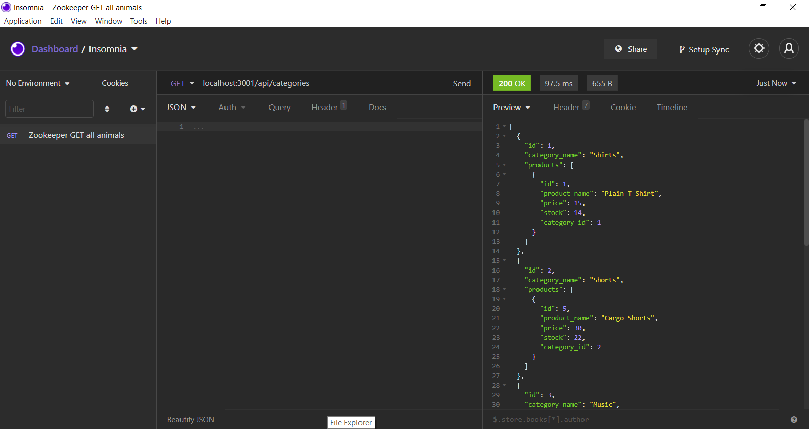
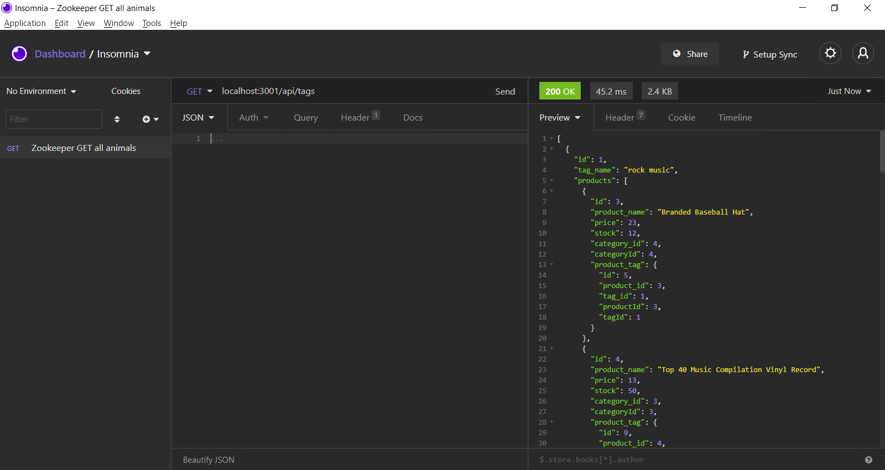
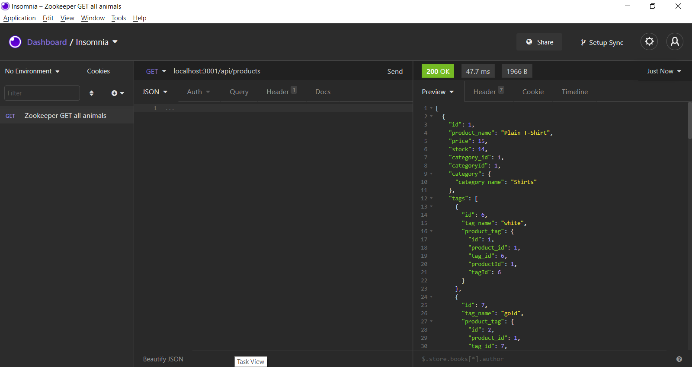

# E-commerce Back End Starter Code

## Purpose
A back end for an e-commerce site powered by Express.js API and Sequelize. This application creates a database using mySQL with models and associations. API Routes are used to perform RESTful CRUD operations utilizing sequelized models. Testing is done thru Insomnia.

## Built With
* Node.js
* MySQL
* Express.js
* Sequelize
* dotenv

## Link to walk thru video of application
https://drive.google.com/file/d/1-sClX_XSzxjUN0bqx11MJP5_2B15LFij/view

## Screenshots of tests

## Contribution
Created by Kellie Werrell :star:

